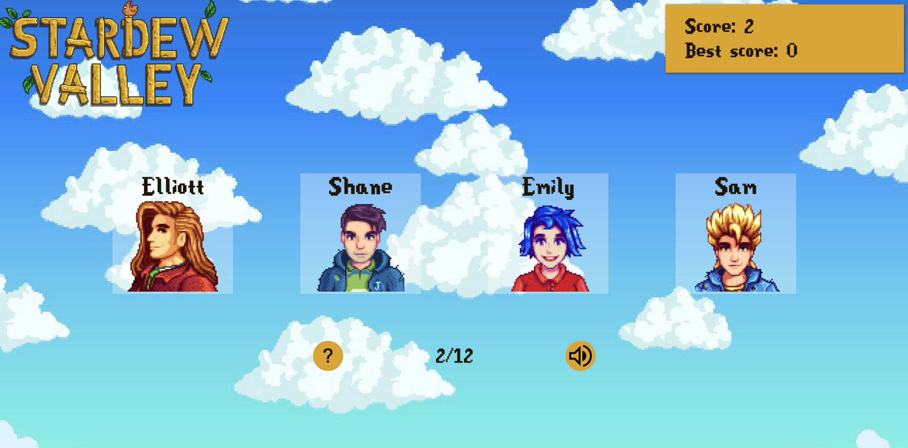

# Stardew Valley Memory Game

This code implements a memory game based on one of my favorite games, Stardew Valley. The game displays a set of cards, each with a character's name and picture. If the player clicks on a card that they have already clicked on, the game is over. If the player clicks on all the cards without making any mistakes, they win the game.

[**Link to project:**](https://memory-card-chi.vercel.app/)

## How It's Made:

**Tech used:** React & Typescript

The code defines several variables that keep track of the state of the game, such as which characters have already been clicked on and whether the game is over. It also defines several functions that handle user input and game logic.

The code uses a technique called *randomization* to shuffle the characters each time the game is played, so the player won't see the same characters in the same order every time.

## Optimizations

- [ ] Add a easy, medium and hard mode 
- [ ] Make the design responsive for mobiles

## Lessons Learned:

-  I learned about *Fisher-Yates shuffle algorithm* to mix the cards
- *Modular code* The project uses modular code to break down the application into smaller and more manageable parts.

